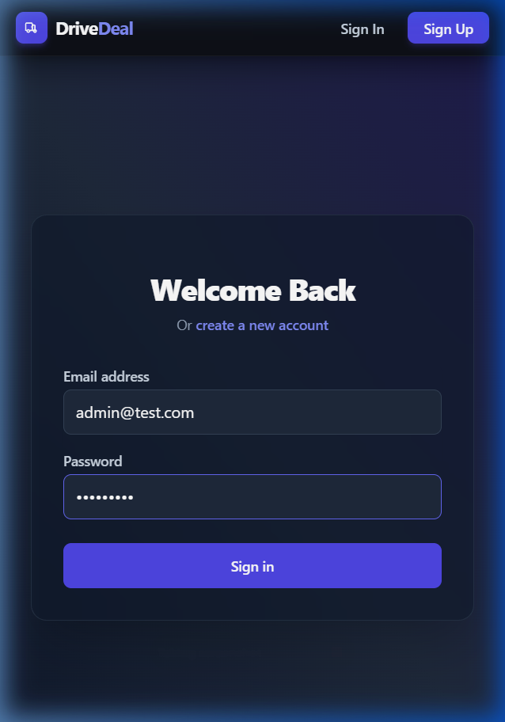
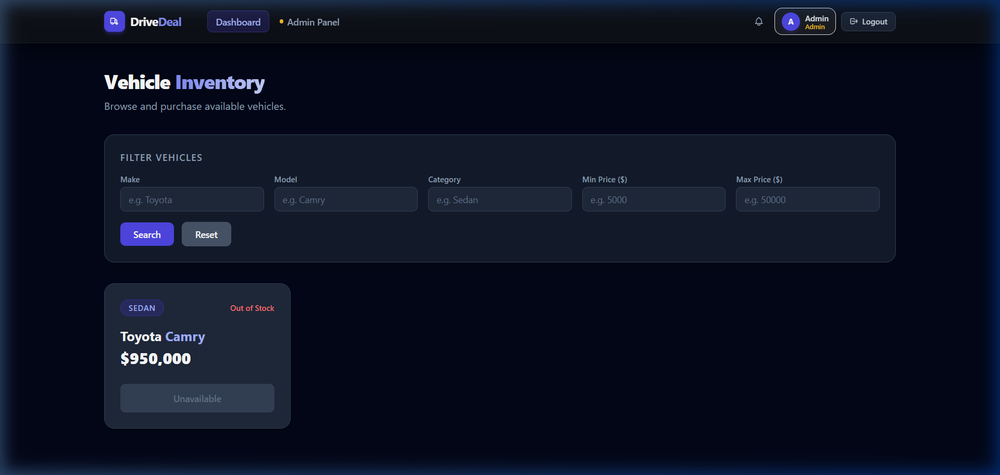
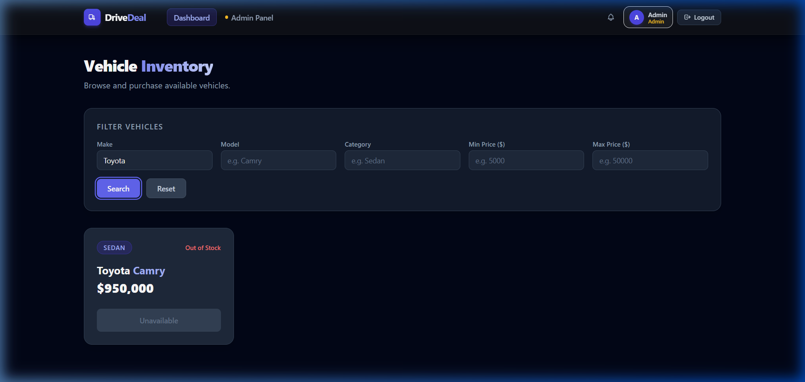
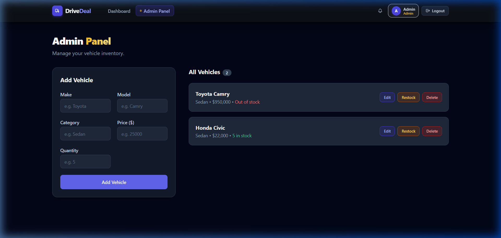

# Car Dealership Inventory System

## Project Overview
The Car Dealership Inventory System is a full-stack web application designed to manage a vehicle dealership's stock. It allows users to register accounts, sign in, search/filter through vehicles (by make, model, category, and price range), and purchase vehicles (which automatically decrements the stock quantity). The application also features a secure, role-based Admin Panel where administrators can add new vehicles, update vehicle details, restock vehicles (incrementing quantities), and delete vehicles from the inventory. It is built using Node.js/Express, MongoDB, React, Vite, Tailwind CSS, and the React Context API, with all core logic validated through test-driven development (TDD).

---

## Folder Structure

```text
Car-Dealership/
├── backend/
│   ├── src/
│   │   ├── config/             # Database connection setup
│   │   ├── controllers/        # Express route controllers (auth & vehicles)
│   │   ├── middleware/         # Authentication and role verification middleware
│   │   ├── models/             # Mongoose database schemas (User, Vehicle)
│   │   ├── routers/            # Express route maps
│   │   ├── services/           # Core business logic services (TDD-driven)
│   │   ├── app.js              # Express middleware and app setup
│   │   └── server.js           # App server listener and DB loader
│   ├── tests/                  # Backend unit and integration test suites
│   ├── .env                    # Backend environment configurations
│   └── package.json
│
├── frontend/
│   ├── src/
│   │   ├── api/                # Axios instance configuration & request interceptors
│   │   ├── components/         # Visual widgets (Navbar, SearchBar, VehicleCard, etc.)
│   │   ├── context/            # React Context stores (AuthContext)
│   │   ├── pages/              # Layout pages (LoginPage, RegisterPage, AdminPage,DashboardPage)
│   │   ├── App.jsx             # Layout frame and route mapper
│   │   └── main.jsx            # React root component injector
│   ├── .env                    # Frontend environment configurations
│   ├── vite.config.js          # Vite configs and Vitest runner setup
│   └── package.json
│
├── screenshots/                # Application preview screenshots
└── TESTREPORT.md               # Summary of all pass/fail test cases
```

---

## Setup Instructions

A stranger should be able to clone this repository and run the application locally by following these steps:

### 1. Backend Setup
1. Navigate to the backend directory:
   ```bash
   cd backend
   ```
2. Install the backend dependencies:
   ```bash
   npm install
   ```
3. Create a `.env` file in the `backend/` root directory and specify the following environment variables:
   ```env
   MONGO_URI=mongodb+srv://<username>:<password>@cluster.mongodb.net/<dbname>
   JWT_SECRET=your_jwt_secret_key_here
   PORT=5000
   ```
4. Start the backend development server:
   ```bash
   npm run dev
   ```

### 2. Frontend Setup
1. Navigate to the frontend directory:
   ```bash
   cd frontend
   ```
2. Install the frontend dependencies:
   ```bash
   npm install
   ```
3. Create a `.env` file in the `frontend/` root directory and specify the API URL:
   ```env
   VITE_API_URL=http://localhost:5000/api
   ```
4. Start the frontend development server:
   ```bash
   npm run dev
   ```

*Note: The frontend server will typically run at [http://localhost:5173/](http://localhost:5173/) or [http://localhost:5174/](http://localhost:5174/) depending on local port availability.*

---

## API Endpoint List

The backend exposes 9 primary REST API endpoints under `/api`:

### Authentication Endpoints
* **`POST /api/auth/register`** — Registers a new user account. Expects `email`, `password`, and optional `role` (`"user"` or `"admin"`) in the JSON body.
* **`POST /api/auth/login`** — Authenticates a user's credentials. Returns a signed JWT token on success.

### Vehicle Endpoints
* **`POST /api/vehicles`** — Creates a new vehicle in the inventory. Requires authentication. Expects `make`, `model`, `category`, `price`, and `quantity` in the body.
* **`GET /api/vehicles`** — Retrieves the complete list of all vehicles in the inventory. Requires authentication.
* **`GET /api/vehicles/search`** — Searches vehicles based on query filters (`make`, `model`, `category`, `minPrice`, `maxPrice`). Requires authentication.
* **`PUT /api/vehicles/:id`** — Updates the details of an existing vehicle by ID. Requires authentication.
* **`DELETE /api/vehicles/:id`** — Deletes a vehicle by ID from the database. Requires Admin privileges.
* **`POST /api/vehicles/:id/purchase`** — Purchases 1 unit of a vehicle, decrementing its quantity by 1. Requires authentication. Fails if quantity is already 0.
* **`POST /api/vehicles/:id/restock`** — Adds quantity back to the vehicle stock. Requires Admin privileges. Expects `quantity` to add in the JSON body.

---

## Screenshots

Below are screenshots of the fully functioning application user interface:

### 1. Login Page
Shows the login screen with role selection options available on the registration flow.


### 2. Dashboard Page
Displays the vehicle card list with stock indicators and the purchase options.


### 3. Search and Filtering
Demonstrates filtering the inventory using parameters such as Make, Model, Category, or Price Range.


### 4. Admin Panel
Shows the split layout with the vehicle management actions (Edit, Restock, Delete) on the right and the Add/Edit form on the left.


---

## Test Report Summary

The business logic and API endpoints are thoroughly tested. For a detailed breakdown, see the full [TESTREPORT.md](TESTREPORT.md).

### Headline Numbers:
* **Test Suites:** 11 passed / 11 total (100% success rate)
* **Tests:** 37 passed / 37 total (100% success rate)
* **Coverage Summary (All Files):**
  - **Statements:** 85.89%
  - **Branches:** 78.43%
  - **Functions:** 95.23%
  - **Lines:** 85.89%
* **Service Layer Code Coverage (`src/services`):** **95.49%**

---

## My AI Usage

### Tools Used
This project was developed with pair-programming assistance from **Antigravity** (Google DeepMind) and **Claude** (Anthropic) and **Gemini** .

### Specific Examples of AI Collaboration
* **Scaffolding and TDD Boilerplate**: Used Claude to set up Jest tests for the service layer and generate mock assertions for the authentication flow.
* **Backend Database Queries**: Collaborated with Antigravity to build case-insensitive regex matching for fields (`make`, `model`, `category`) and numerical bounds checking in the `searchVehicles` service.
* **Frontend UI Components**: Used Antigravity to generate clean, styling-rich components using Tailwind CSS for `VehicleCard`, `VehicleForm`, and `SearchBar`.
* **Testing Library Assertions**: Wrote Vitest assertions using `@testing-library/react` and `jsdom` with the help of Antigravity to verify form validations and component disabling states.

### Reflections
* **What it sped up**: AI assistance dramatically accelerated the creation of modern visual styles using Tailwind CSS. Writing standard REST endpoint controllers, mock services, and router configurations took minutes rather than hours. Writing basic tests and mapping out endpoints was also very fast.

---

## Workspace Prompts

The full chronology of prompts and AI responses guiding this project's development can be reviewed in [PROMPTS.md](PROMPTS.md).